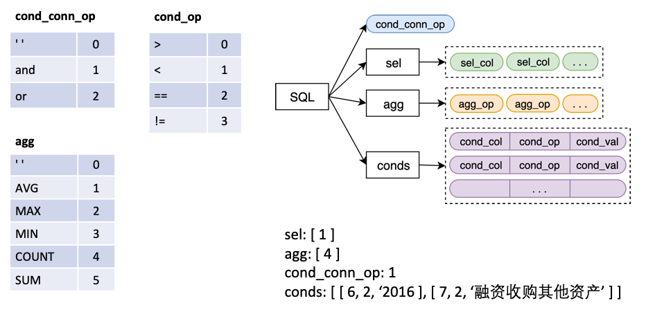
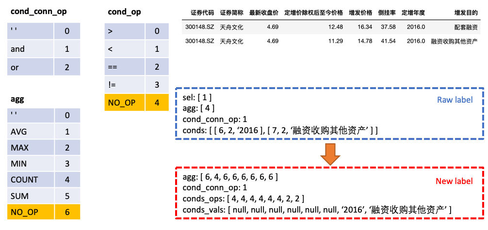
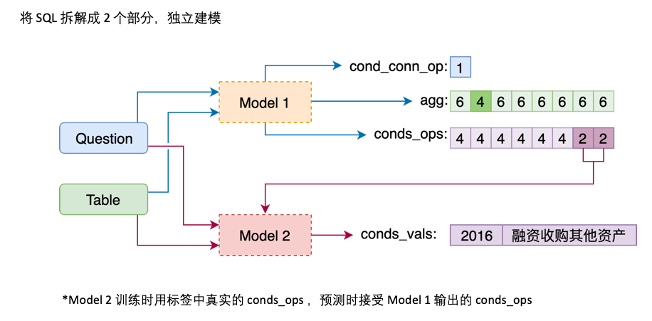
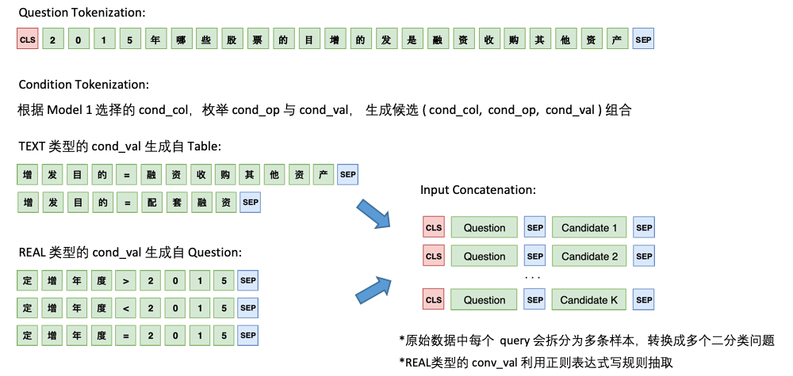
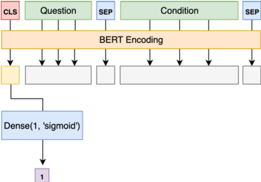
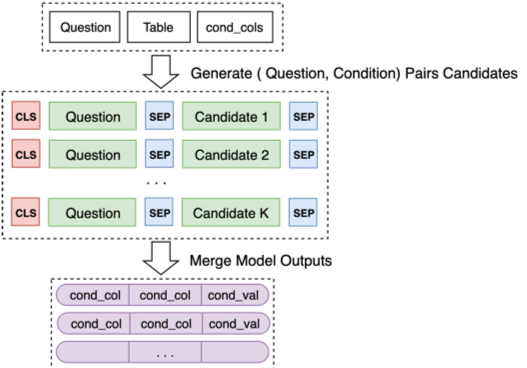

# 首届中文NL2SQL挑战赛

[竞赛链接](https://tianchi.aliyun.com/competition/entrance/231716/introduction)

>:warning: 由于可能存在的版权问题，请自行联系竞赛平台或主办方索要竞赛数据，谢谢!

## 成绩

本项目所采用的方案在复赛中的线上排名为第5，决赛最终成绩排名第3。

主分支下的代码以 jupyter notebook 的形式呈现，以学习交流为目的，对原始的代码经过一定的整理，并不会完全复现线上的结果，但效果不会差太多。

code 目录下的 [model1.ipynb](https://nbviewer.jupyter.org/github/beader/tianchi_nl2sql/blob/master/code/model1.ipynb) 与 [model2.ipynb](https://nbviewer.jupyter.org/github/beader/tianchi_nl2sql/blob/master/code/model2.ipynb)为建模流程，`nl2sql/utils` 目录则包含了该任务所需的一些基础函数和数据结构。

## 致谢

- 感谢追一科技的孙宁远对本次比赛做了细致的赛前辅导
- 感谢追一科技研究员、[科学空间](https://kexue.fm/)博主苏剑林，分享了大量关于NLP方面的优质博文。本方案受到了[基于Bert的NL2SQL模型：一个简明的Baseline](https://kexue.fm/archives/6771)这篇文章的启发。项目中使用的 RAdam 优化器的实现直接来自于苏剑林开源的 [keras_radam](https://github.com/bojone/keras_radam/blob/master/radam.py) 项目
- 感谢 CyberZHG 大神的开源项目 [keras-bert](https://github.com/CyberZHG/keras-bert)，本次比赛中我们使用了 keras-bert 构建我们的模型。
- 感谢哈工大讯飞联合实验室的 [Chinese-BERT-wwm](https://github.com/ymcui/Chinese-BERT-wwm) 项目，本次比赛中我们使用了他们`BERT-wwm, Chinese` 预训练模型参数

## 背景

首届中文NL2SQL挑战赛，使用金融以及通用领域的表格数据作为数据源，提供在此基础上标注的自然语言与SQL语句的匹配对，希望选手可以利用数据训练出可以准确转换自然语言到SQL的模型。

模型的输入为一个 Question + Table，输出一个 SQL 结构，该 SQL 结构对应一条 SQL 语句。

其中 
- `sel` 为一个 list，代表 `SELECT` 语句所选取的列
- `agg` 为一个 list，与 `sel` 一一对应，表示对该列做哪个聚合操作，比如 sum, max, min 等
- `conds` 为一个 list，代表 `WHERE` 语句中的的一系列条件，每个条件是一个由 (条件列，条件运算符，条件值) 构成的三元组
- `cond_conn_op` 为一个 int，代表 `conds` 中各条件之间的并列关系，可以是 and 或者 or

## 方案介绍

我们将原始的 Label 做一个简单的变换

- 将 `agg` 与 `sel` 合并，`agg` 中对表格中每一列都做预测，新的类别 `NO_OP` 表明该列不被选中
- 将 `conds` 分为 `conds_ops` 与 `conds_vals` 两个部分，这么做的原因是想分两步进行预测。由一个模型先预测 `conds` 需要选取哪些列以及操作符，再由另一个模型预测所选取的列的比较值

### Model 1

Model 1 将 Question 与 Header 顺序连接，在每个 Column 之前添加一个特殊标记，`TEXT` 或 `REAL`，这两个特殊的 Token 可以从 BERT 预留的未训练过的 Token 中任选两个来代替。

Model 1 的架构如下:

### Model 2

Model 2 则负责 `cond_val` 的预测。我们的思路是根据 Model 1 选择的 `cond_col`，枚举 `cond_op` 与 `cond_val`，生成一系列的候选组合，将这些组合当成多个二分类问题来做

Model 2 的架构如下:

最后将 Model 2 对一些列候选组合的预测合并起来

### 模型训练中的一些探索尝试

关于模型训练中的优化，以及一些成功、不成功的 idea，详细可以见我们[决赛答辩ppt](./imgs/ModelS答辩ppt.pdf)。
